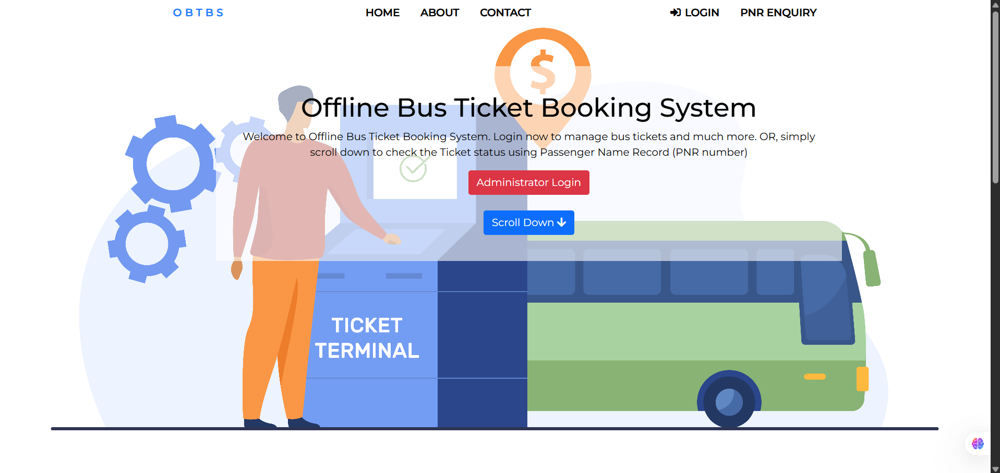

# 🚌 Simple Bus Ticket Booking System (PHP + MySQL)

This is a **Simple Bus Ticket Booking System** that simulates ticket booking at offline counters. Admins manually enter passenger and ticket data, just like in real-world bus depots.

> 🚀 Developed  by **Siddaram Mallikarjun Goranal**

---

## 🧾 About the Project

🎯 This project simulates the workflow of an offline bus ticket booking system. Instead of online reservations, the admin books tickets at the counter and records them through a web panel connected to a database.

✅ It’s simple.  
✅ It’s clean.  
✅ It’s great for learning PHP + MySQL!

---

## 🧰 Tech Stack

| Component     | Technology           |
|--------------|----------------------|
| 💻 Frontend   | HTML5, CSS3          |
| ⚙️ Backend     | PHP (Core)           |
| 🗄️ Database    | MySQL                |
| 🌐 Platform   | XAMPP (localhost)    |

---

## ✨ Features

- 🧑‍💼 Admin panel for adding passenger bookings  
- 🔍 PNR-based ticket verification  
- 📊 Database-connected interface  
- 🧹 Clean, minimal UI for usability  
- ⚡ Light-weight and easy to deploy

---

## 🖼️ Screenshot

Here’s how the homepage looks:



> 💡 Tip: Add more screenshots if you want to highlight other parts like the admin panel or booking form.

---

## 🚀 Getting Started

To run this project on your local machine:

### 📥 1. Clone the Repo or Download ZIP

```bash
git clone https://github.com/siddaram2k25/SimpleBusTicket-PHP.git
